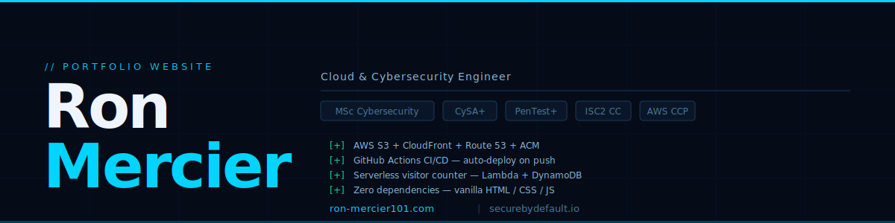
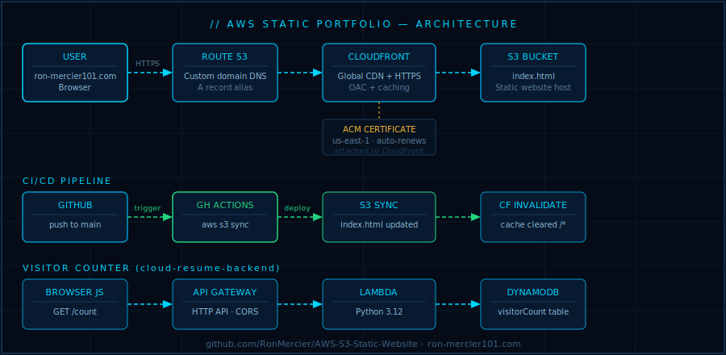

# AWS-S3-Static-Website


**Personal portfolio website - redesigned with a SecureByDefault dark theme and deployed on AWS S3 + CloudFront with automated GitHub Actions CI/CD.**

Live at: **[ron-mercier101.com](https://ron-mercier101.com)**

---



---

## Overview

A fully self-contained single-page portfolio built in vanilla HTML, CSS, and JavaScript - no frameworks, no dependencies, no build step. Deployed to AWS S3 via GitHub Actions on every push to `main`, served globally via CloudFront CDN with a custom domain and SSL/TLS certificate from ACM.

The site integrates a live visitor counter powered by a serverless backend:
**[cloud-resume-backend](https://github.com/RonMercier/cloud-resume-backend)** - AWS Lambda + DynamoDB + API Gateway, deployed via AWS SAM.

---

## Architecture



| Component | Service | Purpose |
|---|---|---|
| **Hosting** | AWS S3 | Static file storage + website serving |
| **CDN** | AWS CloudFront | Global distribution, HTTPS enforcement, caching |
| **Domain** | AWS Route 53 | Custom domain DNS (`ron-mercier101.com`) |
| **SSL/TLS** | AWS ACM | Certificate management, auto-renewal |
| **CI/CD** | GitHub Actions | Automated S3 sync on push to `main` |
| **Visitor counter** | Lambda + DynamoDB + API GW | Serverless backend (separate repo) |

---

## Features

- **Single-file architecture** - all CSS and JavaScript inline in `index.html`; no external dependencies
- **SecureByDefault dark theme** - `#050C18` navy, `#00D4FF` cyan accent, Syne display font, Space Mono monospace
- **Typewriter animation** - cycles through 5 engineering titles in the hero section
- **Animated skill bars** - triggered by Intersection Observer when scrolled into view
- **Fade-in sections** - staggered reveal animations on scroll
- **6 pinned GitHub repos** - project cards linking directly to repositories
- **Contact Me button** - opens user's default email client with `ron@securebydefault.io` pre-loaded
- **Live visitor counter** - footer counter calls the serverless backend API; animates count up on load
- **Responsive** - hamburger menu and mobile layout for all screen sizes
- **Zero JavaScript frameworks** - vanilla JS only, fast load, no bundle

---

## Repository Structure

```
AWS-S3-Static-Website/
├── index.html                 # Complete portfolio - HTML + CSS + JS (self-contained)
├── assets/
│   ├── banner.png             # Repository banner image
│   └── architecture.png       # AWS architecture diagram
├── .github/
│   └── workflows/
│       └── deploy.yml         # GitHub Actions CI/CD - S3 sync on push to main
├── .gitignore
└── README.md
```

---

## AWS Infrastructure Setup

### Prerequisites

- AWS account with appropriate IAM permissions
- AWS CLI configured locally
- Domain registered (Route 53 or external registrar)
- GitHub repository with Actions enabled

### Step 1 - S3 Bucket

1. Create an S3 bucket named to match your domain (e.g., `ron-mercier101.com`)
2. Enable **Static website hosting** → set `index.html` as the index document
3. Configure bucket policy to allow CloudFront access (use Origin Access Control, not public ACLs)

### Step 2 - CloudFront Distribution

1. Create a CloudFront distribution pointing to your S3 bucket origin
2. Set **Origin Access Control (OAC)** - do not make the bucket public directly
3. Set **Default root object** to `index.html`
4. Set **Alternate domain names** to your custom domain
5. Attach your ACM certificate (must be in `us-east-1` for CloudFront)
6. Set **Price class** appropriate for your audience

### Step 3 - ACM Certificate

1. Request a public certificate in **us-east-1** (required for CloudFront)
2. Add the CNAME validation records to Route 53
3. Wait for status to show **Issued**
4. Attach to your CloudFront distribution

### Step 4 - Route 53

1. Create a hosted zone for your domain
2. Add an **A record** (alias) pointing to your CloudFront distribution
3. Add a **AAAA record** (alias) for IPv6 if desired
4. Update your domain registrar to use Route 53 nameservers

### Step 5 - GitHub Actions CI/CD

The deploy workflow syncs `index.html` and assets to S3 on every push to `main` and optionally invalidates the CloudFront cache.

Create these GitHub Secrets/Variables:
- `AWS_S3_BUCKET` - your S3 bucket name
- `AWS_CLOUDFRONT_DISTRIBUTION_ID` - your CloudFront distribution ID
- AWS credentials - either OIDC (recommended) or access key/secret pair

**Recommended: use OIDC instead of stored AWS credentials.** See the [cloud-resume-backend repo](https://github.com/RonMercier/cloud-resume-backend) for a detailed OIDC setup walkthrough.

---

## Visitor Counter Integration

The footer visitor counter calls the serverless API from [cloud-resume-backend](https://github.com/RonMercier/cloud-resume-backend).

In `index.html`, locate:

```javascript
const API_ENDPOINT = 'YOUR_API_ENDPOINT_HERE';
```

Replace with your actual API Gateway endpoint:

```javascript
const API_ENDPOINT = 'https://abc123.execute-api.us-east-1.amazonaws.com/Prod/count';
```

Get the endpoint from SAM outputs after deploying the backend:

```bash
sam list stack-outputs --stack-name YOUR_STACK_NAME
```

**CORS note:** The backend SAM template has CORS locked to `https://ron-mercier101.com`. The counter will only work from that origin. Local development will show `—` in the counter — this is expected and correct behavior.

---

## Deployment

Pushing to `main` triggers the GitHub Actions workflow automatically:

```
git add index.html
git commit -m "Update portfolio"
git push origin main
```

GitHub Actions syncs to S3. After sync, invalidate the CloudFront cache to see changes immediately:

```bash
aws cloudfront create-invalidation \
  --distribution-id YOUR_DISTRIBUTION_ID \
  --paths "/*"
```

Or add a cache invalidation step to your `deploy.yml` workflow so it runs automatically on every deploy.

---

## Local Development

Open `index.html` directly in a browser - no server required. Everything renders correctly locally except the visitor counter (CORS blocks the API call from `file://`).

```bash
# macOS / Linux
open index.html

# Windows
start index.html
```

For a local server (optional, resolves CORS for testing with a proxy):

```bash
python3 -m http.server 8080
# then visit http://localhost:8080
```

---

## Design System

| Token | Value | Usage |
|---|---|---|
| `--bg` | `#050C18` | Page background |
| `--card` | `#0A1628` | Card backgrounds |
| `--border` | `#1A3A5C` | Borders, dividers |
| `--cyan` | `#00D4FF` | Primary accent, links, highlights |
| `--head` | `#EEF5FF` | Headings, primary text |
| `--body` | `#8BB8D8` | Body text |
| `--muted` | `#4A7A9B` | Labels, secondary text |
| `--green` | `#22D37E` | Visitor counter pulse dot |
| Display font | Syne 600/800 | Headings |
| Mono font | Space Mono | Code, labels, nav |
| Body font | DM Sans 300/400/500 | Body copy |

---

## Related Repositories

- [cloud-resume-backend](https://github.com/RonMercier/cloud-resume-backend) - Serverless visitor counter API (Lambda + DynamoDB + SAM)
- [securebydefault-server-hardening](https://github.com/RonMercier/securebydefault-server-hardening) - Linux server hardening configs
- [cloud-security-checklist](https://github.com/RonMercier/cloud-security-checklist) - 28-point security baseline
- [ddos-tabletop-toolkit](https://github.com/RonMercier/ddos-tabletop-toolkit) - DDoS IR tabletop exercises
- [SecureByDefault.io](https://securebydefault.io) - Security engineering blog

---

## License

MIT License - feel free to fork and adapt for your own portfolio.

---

## About

Built by **Ron Mercier** - Cloud & Cybersecurity Engineer.
Previously: DDoS mitigation and incident response at Akamai Technologies.
MSc Cybersecurity · CySA+ · PenTest+ · ISC2 CC · AWS CCP.

[ron-mercier101.com](https://ron-mercier101.com) · [securebydefault.io](https://securebydefault.io) · [LinkedIn](https://www.linkedin.com/in/ron-mercier)
